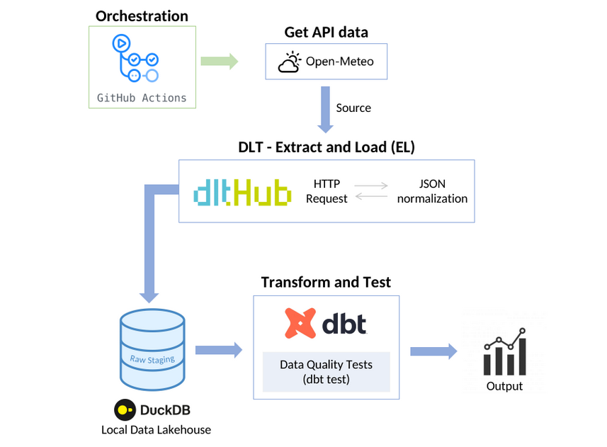

## Weather Data Pipeline (ELT)

  

  <em>Automated ELT data pipeline built with Open-Meteo API, dlt, DuckDB, dbt, and GitHub Actions.</em>

---

## About the Project
A data pipeline that extracts real-time weather information for multiple cities via micro-batching, loads it into a local columnar database, and applies automated transformations with data quality tests.

## Tech Stack
* **Source:** Open-Meteo API
* **Ingestion:** `dlt` (Data Load Tool)
* **Storage:** DuckDB
* **Transformation & Quality:** `dbt Core` (Data Build Tool) + `dbt_utils`
* **Orchestration:** GitHub Actions (scheduled micro-batching)
* **Language:** Python, SQL, Pandas, NumPy
